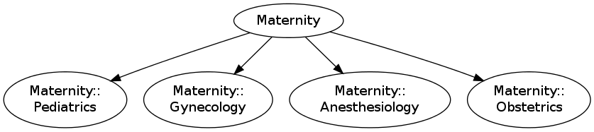
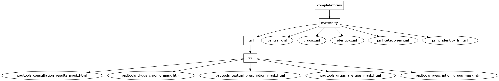
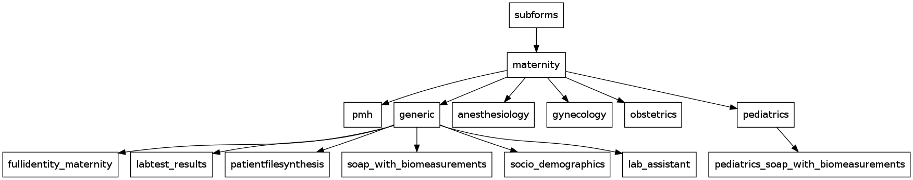

#Espaces de nommage (Namespaces)

##Attribuer des identifiants uniques aux items et aux formulaires

Tous les formulaires et items de formulaires doivent être identifiés par un identifiant unique.

Ces identifiants doivent être persistants dans le temps (dans le cas de mise à jour du formulaire).
Ils sont utilisés pour le stockage des données dans la base de données.

Il est préférable, pour éviter les conflits de nommage, d'utiliser des espaces de nommage. Les
espaces de nommage peuvent être séparés par : '::', ':', '.', '__'.

Nous choisissons "::" comme séparateur.

##Structure des dossiers

Les formulaires xml sont regroupés dans deux dossiers principaux:

* completeforms
* subforms

Chaque formulaire xml doit être placé dans un dossier spécifique:

* plus de clarté
* possibilité d'ajouter:
  * fichier .ui (user interface)
  * fichier .js
  * 1 sous-dossir html contenant le masque d'exportation (xx/*.html) nécessaire
    à l'impression

Pour simplifier, la structure des dossiers suivra la structure des namespaces.

##Forms list / Liste des formulaires

###Preoperative anesthesia consultation / Consultation préanesthésique

####Assessment
[anesthesiology chart assessment tool authored by The College of Physicians and
Surgeons of Ontario] [1]

Chuy, Katherine. “An ICU Preanesthesia Evaluation Form Reduces Missing
Preoperative Key Information.” Journal of Anesthesia & Clinical Research
03, no. 09 (2012). doi:10.4172/2155-6148.1000242. [2]

[1]: https://www.zotero.org/groups/freemedforms/items/itemKey/6RKQ59IX
[2]: https://www.zotero.org/groups/freemedforms/items/collectionKey/XVS5SNVU/itemKey/HIE7UD8J

####Items
* PMH /ATCD
  * medical
  * social (tobacco, alcohol, drugs)
  * anesthesia
    * complications associated with previous anesthetics
    * family history of adverse reactions to anesthesia
  * Allergies (medication, latex)
* Airway assessment evaluation / Evaluation des voies aériennes
  * Mallampati score / Score de Mallampati
  * State of dentition review / Etat dentaire
    * intraoral prosthese / prothèse dentaire (none/aucune, fixed/fixe, removable/amovible [denture, orthodontic appliances] )
  * History of difficult airway / Antécédent d'intubation difficile
  * Pertinent findings / Constatations pertinentes
* Objective, vital signs
  * weight / Poids
  * height / Taille
  * Temperature / Température
  * Heart Rythm / Fréquence cardiaque
  * Oxygen saturation Sp02 / Saturation en oxygène Sp02
  * Blood pressure / Pression artérielle
